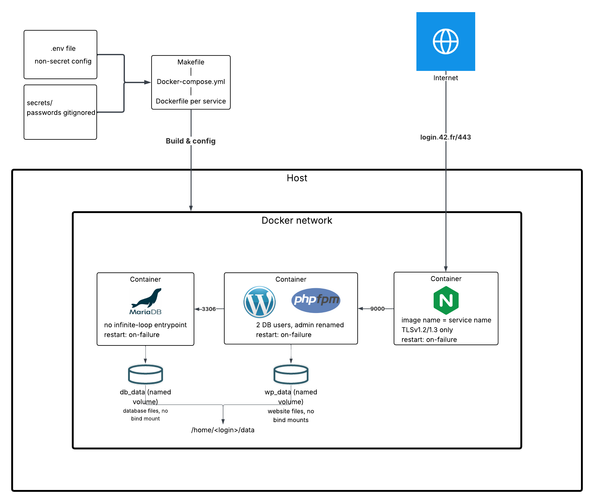

# Welcome to Inception

The inception project is all about learning **Images, containers, Docker-compose, Docker network, volumes** and how these things are managed, to allow services to talk to each other, in a containerized area.

## Project layout

The project consists of main services: 

1) **Infrastructure**: Docker, Docker-compose

2) **Nginx**: reverse proxy

3) **Wordpress**: a free, open-source content management system (CMS) that allows you to build and manage websites without needing to know how to code.

4) **php-fpm**: Used by wordpress to run wordpress.

5) **Mariadb**: a popular, open-source relational database management system (RDBMS)

## Big picture 

  

New to docker ? [start here](oh-my-dock/Start_here.md)

[Main concept](oh-my-dock/main_concept.md)
