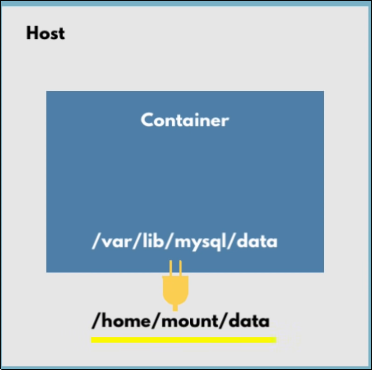

* The whole point of volumes is to persist data to avoid it from disappearing if the container restarted or removed.

* Directories in physical host file system is **mounted** into the virtual file system of Docker. 



---
## There is mainly 3 ways in docker to make a persist volume: 

1) **Host volumes**: you decide **where on the host file system the reference is made**. This is called **Bind mount**.  `docker run -v /host/path : /container/path`

In docker compose:
```yaml
volumes:
  - /data:/var/www/html
```

2) **Anonymous volumes**: It's a named volume **without a name** ???? Docker creates it automatically, gives it a random hash-like ID instead of a meaningful name, and you can't easily reference it.

```yaml 
volumes: 
  - var/www/html
```

> No `source:host-path-or-name`


3) **Named volumes**: you can **reference** the volume by name. This is what should be used in production. Controlled by docker itself.

- Docker command: `docker run -d --name my_container -v my_data:/app/data nginx`

- In docker compose:
```yaml 
volumes:    <--- It's made separately in compose
  volume_name: 
   driver: local

services:
  nginx:
    volumes: 
      - volume_name:/var/www/html # named_volume:container_dir_path
```
